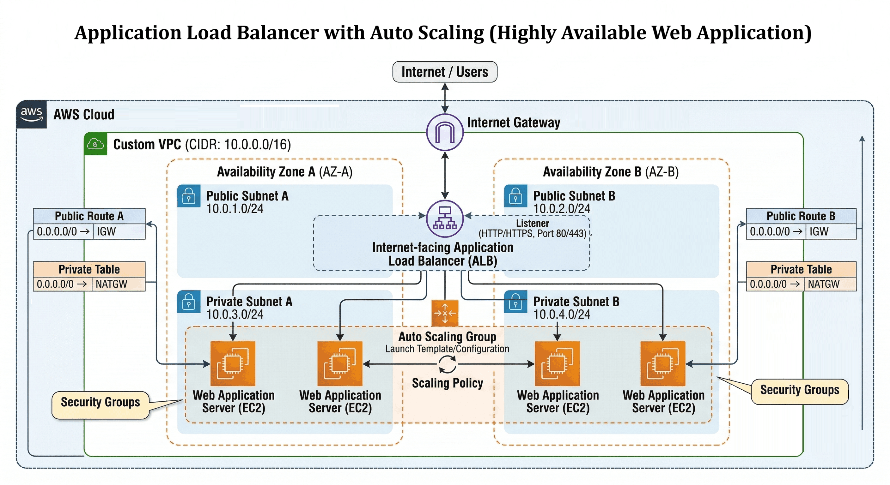

# 🌐 Application Load Balancer with Auto Scaling (Highly Available Web Application)

## 📋 Project Overview
This project focuses on designing and deploying a highly available and scalable web application on AWS using an Application Load Balancer (ALB) and an Auto Scaling Group (ASG). The objective was to ensure the application can handle variable traffic loads, automatically recover from failures, and remain accessible by distributing traffic across multiple EC2 instances and Availability Zones.

## 🎥 Project Demonstration
Watch the full implementation and auto-scaling traffic simulation here:  
**[▶️ Watch Project Video on My Portfolio](https://d2wzfn8f9c4zw5.cloudfront.net/project-06.html)** 

**Project Context:** Scalable Enterprise Web Infrastructure  
**Timeline:** 4 Weeks (Load Balancing & Auto-Scaling)  
**Environment:** Fault-Tolerant AWS Production  
**Core Tech Stack:** ELB, ASG, AWS EC2, VPC, Subnets, Linux, Security Groups  

## 🎯 Objectives
- Deploy a web application using EC2 instances.
- Distribute incoming traffic using an Application Load Balancer.
- Automatically scale EC2 instances based on demand.
- Achieve high availability using a multi-AZ architecture.
- Implement health checks and fault tolerance.

## 🌍 Environment Details
- ☁️ **Cloud Provider:** AWS
- ☁️ **Region:** ap-south-1 (Mumbai)
- ☁️ **Availability Zones:** ap-south-1a, ap-south-1b
- ☁️ **Network:** Custom VPC with public and private subnets

## 🏗️ Architecture Diagram

## 🧱 Architecture Components
- 🏗️ **Application Load Balancer (ALB):**
  - Deployed in public subnets
  - Listens on HTTP (80) / HTTPS (443)
  - Distributes traffic across EC2 instances
  - Performs health checks
- 🏗️ **Auto Scaling Group (ASG):**
  - Deployed in private subnets
  - Automatically launches or terminates EC2 instances
  - Maintains desired capacity
  - Ensures fault tolerance across AZs
- 🏗️ **EC2 Instances:**
  - Amazon Linux OS
  - Apache / NGINX web server
  - No public IPs
  - Receives traffic exclusively from the ALB
- 🏗️ **Launch Template:**
  - Defines EC2 configuration
  - Includes AMI, instance type, security groups, and user data
  - Used by the Auto Scaling Group
- 🏗️ **Security Groups:**
  - ALB SG: Allows HTTP/HTTPS from the internet
  - EC2 SG: Allows traffic strictly from the ALB SG

## 🔁 Traffic Flow
* **Inbound Traffic:** Users access the application via a browser.
* **Routing:** Request reaches the Application Load Balancer.
* **Distribution:** ALB forwards traffic to healthy EC2 instances.
* **Processing:** EC2 instances serve the web content.
* **Scaling:** Auto Scaling dynamically adjusts capacity based on load.
> ☑️ *Note: Users never directly access the backend EC2 instances.*

## 🔐 Security & Best Practices Implemented
- 🛡️ EC2 instances strategically placed in private subnets.
- 🛡️ No public IPs assigned to application servers.
- 🛡️ Traffic strictly restricted using security groups.
- 🛡️ Health checks ensure only healthy instances receive traffic.
- 🛡️ Multi-AZ deployment configured for high availability.

## 🧪 Validation & Testing
- [x] Verified application access via ALB DNS name.
- [x] Simulated traffic to trigger scale-out events.
- [x] Confirmed new instances automatically launched.
- [x] Tested instance termination and auto-recovery processes.
- [x] Validated accurate load distribution across instances.

## 💡 Key Learnings & Why This Project Matters
Through this project, I learned how to design and deploy a highly available and scalable web application using AWS managed services. I gained hands-on experience with Application Load Balancers, Auto Scaling Groups, and EC2 launch templates, and understood how traffic is distributed across multiple instances and Availability Zones. 

The project helped me understand real-world scalability concepts, health checks, fault tolerance, and how AWS automatically maintains application availability during traffic spikes or instance failures. This project demonstrates the ability to build highly available, fault-tolerant, and scalable cloud applications, which are essential requirements for real-world production systems and highly valued skills for Cloud and DevOps Engineer roles.
